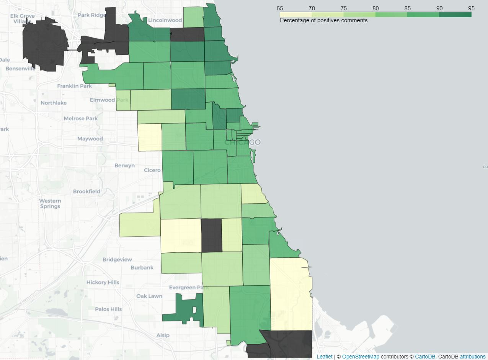

---
# Feel free to add content and custom Front Matter to this file.
# To modify the layout, see https://jekyllrb.com/docs/themes/#overriding-theme-defaults

layout: home
---

<h1> Chicagoan Restaurants </h1>

<h4> Beyond the menu: where to eat in Chicago? </h4>

*Chicago Skyline*

<h2> Introduction – What is this about? </h2>

Ranking third in the list of the United States’ most populous cities, Chicago is renowned for witnessing the nascence of the most popular dishes in North-American cuisine. The city has built itself a solid reputation in the food-related field with the quite numerous restaurants and food establishments it features. Yet, it is not always easy to know, neither for locals nor for tourists, where to eat best by Lake Michigan! We will try and provide our help, making this choice easier for anyone. Rather than considering solely one’s taste or the reputation of a restaurant, we’d like to combine different factors of which mainly safety, be it the sanitary aspect or the security in the neighborhood.
The most intuitive way to solve that issue, remains without a doubt the comparison of understandable scores between restaurants. Yet, the visual representation of their spatial distribution on a map can make it more convenient to know where to go. Relying on different datasets, we have established an overall score that reflects various aspects of one’s experience with a food establishment, namely the hygienic quality, the pricing, previous customers’ experiences and the safeness of the neighborhood it’s located in. Follow us while we tell you how we have managed to do so…

<h2> Datasets, Methods and Results - Show me, what have you done with all that data? </h2>

First of all, let us introduce you to the datasets we have relied on for the following analysis. The main idea consists of establishing a score, representing the values for some features of the datasets. Normalizing the different scores will then allow us to combine them into an overall one, making it easy to compare restaurants. This is mainly done using a min-max scaling.  We’ll also show you the results it led to.

<h2> Chicago Food Inspections </h2>

The food itself is indeed in the center of one’s experience with a food establishment. This dataset presents different variables concerning the quality of a restaurant and depicts its sanitary condition. We have decided to focus mainly on the risk and the violations. Score is the key word here! In fact, we intend to attribute a weight for the different values of risk and violations in order to make them comparable.

<h3> Risk </h3>

An inspection alone provides little information on the average hygiene quality of an establishment. Indeed, the standard is to pass inspection in order to run the business. On the other hand, we note that an establishment can miss its inspection for one of its licenses and then, as a result, generally pass the inspection again a week later.
In order to give a general representation of the sanitary quality of the establishments, we wanted to provide a performance score based on the inspection history of each establishment. For example, a restaurant that tends to go through many inspection before passing one, shows a poor sanitary quality, whereas an establishment that passes each of its inspections has a good sanitary quality.
We also based our score on the subject of the inspection. If a complaint, poisoning or illegal matter is the cause of the inspection, the establishment will be penalized.
In this way we have obtained the score per establishment, which when normalized gives the following distribution:

*Score per establishment*

Since the variance of this distribution is low, we used quantiles to divide the population into 5 groups. From the group with the lowest scores to the group with the highest scores, we assigned 1 to 5 stars respectively. In this way we obtained a score that is evenly distributed over all the establishments. By averaging this score per district, we obtained the following map.

*Stars per zip area*

On this map we can conclude that the high ranked establishments are concentrated in specific districts while the low ranked establishments are spread all over the city. This is the consequence of a non-correlation between the geographical position of the establishment and its score.

<h3> Violations </h3>

Concerning the violations, the analysis allowed us to point out some common ones that appear frequently regardless of the inspection results. In order to compute a score, these should have a lower weight than the uncommon ones that appear exclusively in failed inspections. The idea would be to obtain a score that penalizes serious violations and tolerates the common ones, which let the restaurant pass nevertheless. The maximum score should be reached when there is absolutely no violation, reflecting thus the best quality. However, the normalization of the score requires various aspects to be taken into account such as the number of inspections undertaken on one same restaurant and the evolution of its results in time or from a “license” inspection to another.
Inspections give us another piece of information that is not taken into account here: the health violations observed at each inspection under a license. The goal was to break down the types of violations into categories. We then assign to these categories a weight that corresponds to the importance of the violation in the failure of an inspection. Thus, the more a category is represented in the total number of failed inspections, the greater the weight will be.
Thus we can calculate the sum of the weights of the violations of each inspection. We observe that the distribution of this sum is different in the pool of failed inspections compared to the pool of successful inspections. However they are really close to each other so that determining the violation categories referenced in an inspection doesn’t help us to predict the result of it.

We associate each license to weigh the result by the frequency of inspection of the license. Finally, by averaging these results we obtain a positive score for each establishment. This score increases with the severity of the violations observed in each establishment. It is positive and is zero if and only if the establishment has never committed violations during its inspections.

*Violations score per zip area*

<h2> Crime incidents </h2>

As one of the most populous North-American cities, Chicago features a non-negligible crime rate. We therefore pay attention to the safety of a neighborhood. A score will be attributed to different areas of the city according to the number of crime incidents that were reported there. The delimitation is based on the ZIP code. Therefore, a restaurant will score safeness based on its address. Do dangerous neighborhoods have also high failed rate of inspection? Can it be an asset to take into account when rating a restaurant? We will try and answer these questions. However, it is important to mention that only crime incidents that occur in public space, therefore affecting the peace and harmony of a neighborhood, will be taken into account.
No major criminological knowledge is required for conceiving expectations and understanding of the observations. We have tried to weigh the rate according to the number of inhabitants of each area, yet it does not appear to be relevant in this context. Indeed, roughly summarized, the public aspect of the crime incidents we are here interested does not fall under the number of residents in an area but rather on the mobility and daily activity it witnesses. In that case, the difference would be drastic between downtown and other areas. Thus we have limited the crime analysis in counting the number of occurrences per area, being more homogeneous and understandable. The project not consisting of a crime analysis per se, the aggregation errors or the ecological fallacy induced by the different sizes of ZIP areas will not be discussed.

*Crimes per zip area*

As we can see, crimes are not evenly distributed between the different areas. In fact, the southern part of the city appears to witness higher number crime incidents, and so does the east, whereas the northern part looks safer. We would have expected to see a concentration of crime occurrences around downtown as most of Chicago’s activity is located there. However, this relatively low crime rate can be explained by the fact that the city center is subdivided into different ZIP areas and that the latter present an even distribution of crime incidents. Thus, since only the number of incidents is taken into account, the crime rate would have risen if these areas were grouped.
Based on these assumptions, we then computed a score per ZIP area as such :

\\[Score_{zip-area} = \frac{crime - crime_{min}}{crime_{max} - crime_{min}} * 100\\]

The score is scaled using “min-max scaling” and multiplied by 100 to be consistent with the other scores that are detailed later.

<h2> User reviews on Yelp </h2>

Finally, in order to obtain as much information as possible concerning restaurant, we have collected data on Yelp as it presents interesting data, namely users’ review, mean rating and price indication.
For this data set, we computed 3 scores per restaurants :

<h3> Users’ review </h3>

Customers’ previous encounters with an establishment do play a crucial role in the calculation of the score for a restaurant. Therefore, a sentiment analysis was conducted on Yelp reviews to help the score be as complete and representative as possible. In fact, the comments left by customers are divided into two mutually exclusive categories, namely positive and negative feedback. This is done using VADER (Valence Aware Dictionary and sEntiment Reasoner), which is lexicon and rule-based NLP tool.
Having divided the reviews into two categories, the positive and negative, we would like to observe their distribution on the map.

*average positive reviews per zip area*

*average negative reviews per zip area*

As we can see, both positive and negative seem to be concentrated around downtown Chicago, namely the north-eastern part of the city. This can be explained by the number of restaurants and amount of reviews available there. Areas featuring a low number of restaurants and restaurants being provided a low number comments were dismissed as they do not appear to be representative of the data. In order to test the consistency of the data and the success of the sentiment analysis, the average rating (given with the comments) was computed for both the positive and negative category. Comments classified as obtained an average restaurant rating below 2/5 where the ones with mainly positive feedback score above 4/5, validating thus the previously obtained results. Another map can therefore be generated by this time using as metric the percentage of positives comments and confronted to the previous one.

*percentage positive reviews per zip area*

It is quite interesting to mention that on area with zip 60636, located in the south-western part of town, featured a majority of negative comments (29 out of 47) and had a percentage of negative comments almost 2 times higher than any other region (61% against 35% for the second worst region). Since we only have seven restaurants featured in this area this appears to be an outlier caused by the lack of data and so it won’t be considered. But we can however suppose that the restaurants there are more likely to be of poor quality.

Other than that we can again observe an uneven distribution over the city. Some areas have a way better percentage of positive comments than others. They are mostly situated in the north and in the center of the city. So we can say that this a good indicator that restaurants in thoses area seems be well appreciated by the customers overall.

To compute the score we did exactly as mentioned previously:

\\[Score_{reviews} = \frac{comments_{pos}}{comments_{total}} * 100\\]

<h3> Mean Rating </h3>

The platform also provides an average rating for each restaurant. If we here intend to establish our own scores based on criteria we have thoroughly analyzed, it is always helpful to complete it with ratings established beforehand by the people who have dealt with the establishment.
Since this score is already computed by Yelp we used it directly. In order to properly plot this on a map, we plotted the average of the mean rating per ZIP Area :

*rating per zip area*

There appears to be a concentration of well-rated establishments around the city center and in the northern part of Chicago. The data available for the southern part of the city shows that the restaurants are poorly rated there.
In order to be easier for us to compare the different scores we decide to scale them between 0 and 100, so the final score is :

\\[Score_{rating} = \frac{rating}{rating_{max}} * 100\\]
With \\[rating_{max} = 5\\]

<h3> Price indication </h3>

Moreover, the Yelp platform offers a pricing classification that roughly indicates whether a restaurant is rather expensive or not. The price indications are split into 4 categories. This variable will also be considered as one’s choice of restaurant is indeed affected the amount of money they are willing to spend on food. In  the data we are dealing with, the values concerning the pricing of different food-establishments is distributed as follows:

*distribution of restaurants prices*

As we can see, we clearly have way more restaurantsin the category 1 and

Now spatially,  here is the distribution over the city according, once again, to the ZIP area :

*price positive reviews per zip area*

There seems to be a concentration of rather pricey restaurants in the city center. This is not surprising as most establishments tend to get more expensive the closer they are to the city center that is usually touristic and financially strategic.  
To compute the final score that is assigned to each restaurant, we rescaled the scores between 0 and 100 :

\\[Score_{price} = \frac{price}{price_{max}} * 100\\]
With
\\[price_{max} = 4\\]

<h2> All of the above </h2>

Now that you are aware of all the aspects we have analyzed we can finally jump to the overall score. Indeed, this was our aim all the way! In order to establish one single value for each restaurant we have combined the different scores by adding them up. It was possible to estimate the importance of the various variables and weigh them accordingly. For instance, important features such as the inspections are multiplied by 1.2, whereas others of lesser importance are multiplied by 0.5. Otherwise, no weight is attributed and the feature is just multiplied by 1. Note that this can be a subjective process, since we have considered for example that the price is not too important compared to the inspection scores. An idea for a hypothetical  further use in an interactive public application for instance, would be to let the user choose the weights per score according to their own criteria and preferences.

Now, in order to know where to go, here is the spatial distribution:

*final results map*

We notice clear differences between areas. Indeed, The city center and the northern part of town seem to score well on all the desired criteria. On the other hand, we would not advise neither the western nor the southern part of town as they do not appear to feature the best experience food-wise.

<h2> Conclusion – So, where to eat? </h2>

All in all, we can see that most features vary from an area to another. If you are asking yourself where to eat in Chicago, we’d advise the city center, located on the north-eastern part of  town!

However, many aspects concerning the data would be interesting to depict. Indeed, at times the results obtained after some steps were undertaken did not match our expectations. For instance, concerning the Risk analysis in the Food Inspection dataset we first had assumption that appeared to be false after further understanding. We therefore, tried and figured out various options to build a score that would be as complete as possible, learning to tame our data and making it speak, on the way.
